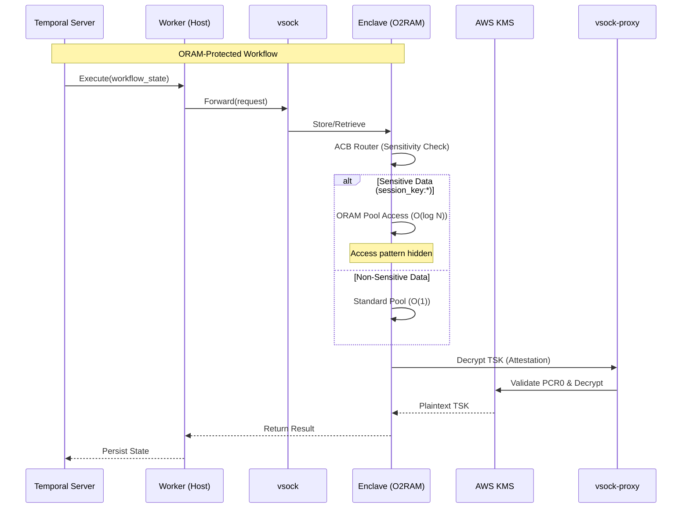

# Compartmentalized Side-Channel Defense using Oblivious RAM

> **ORAM-MAW** — Proof of Concept

## Project Overview

This Proof of Concept (POC) demonstrates securing highly sensitive sections of the **Attested Confidential Blackboard (ACB)** against memory side-channel leakage by selectively applying **Oblivious RAM (ORAM)**.

This architecture addresses Access Pattern Attacks (APA) by hiding memory access sequences. By integrating Path ORAM with AWS Nitro Enclaves and Temporal, this solution ensures that sensitive data access patterns remain hidden from both the host infrastructure and external observers through doubly oblivious (O2RAM) protection.

## Confidential & Compartmentalized Storage

- Oblivious access to critical secrets (session keys, ephemeral tokens) using Path ORAM.
- Sensitivity-based routing ensuring ORAM overhead is proportional to data criticality.
- Standard encrypted storage for high-volume, less-sensitive workflow state.
- Hardware-enforced isolation with TEE-based doubly oblivious RAM (O2RAM).

## Architecture



## Getting Started

### Quick Start

```bash
# Clone the repository
git clone https://github.com/0xktn/oram-maw-poc.git
cd oram-maw-poc

# Automated Setup (Creates EC2, KMS & Builds Enclave)
./scripts/setup.sh
```

### Run a Workflow

Trigger an ORAM-protected workflow execution:

```bash
# On the EC2 instance
./scripts/trigger.sh
```

### Verification

Verify ORAM is actively protecting access patterns:

```bash
./scripts/trigger.sh --verify
```

For performance benchmarking:
```bash
./scripts/trigger.sh --benchmark
```

**Expected Output**:
```
━━━━━━━━━━━━━━━━━━━━━━━━━━━━━━━━━━━━━━━━━━━━━
ACB Security Summary
━━━━━━━━━━━━━━━━━━━━━━━━━━━━━━━━━━━━━━━━━━━━━
ORAM-Protected Accesses: 10
Standard Accesses: 100
ORAM Usage: 9.1%

ORAM Pool Status:
- Entries: 10
- Stash Size: 2
- Tree Height: 8
```

## References

- [ORAM Concepts](docs/ORAM_CONCEPTS.md)

- [System Reference & Troubleshooting](docs/REFERENCE.md)

## License

This project is licensed under the MIT License - see the [LICENSE](LICENSE) file for details.
